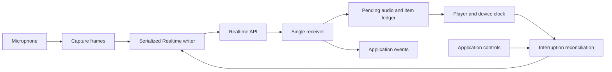

# Ruby local audio and Realtime session design

[Notion design](https://app.notion.com/p/3d58e50b62b08145948ee467f4bd9bfb)

**Status:** approved implementation is available in this worktree, with automated validation and independent review. No package has been published. The contracts below are the acceptance criteria. Native platform binaries and physical timing validation remain release gates. See [usage documentation](../../local-audio.md) and [companion build instructions](../../packages/openai-audio/README.md).

**Review gate:** before push or PR, the complete implementation must pass two consecutive clean rounds of independent paired adversarial review, plus relevant tests, lint, type and custom-code budget checks. Physical-device timing and platform qualification remain separate release gates.

**Outcome:** Ruby applications can record/transcribe/play a finite clip, compose live PCM devices themselves, or run an interruptible local Realtime voice conversation without writing device, playback-clock, or WebSocket coordination code.

**Acceptance:** keep the existing upload/HTTP contracts; capture and play concurrently; support server VAD, semantic VAD and push-to-talk; preserve conversation/audio alignment on interruption; handle slow consumers, large output, disconnects and device failure explicitly; release every owned resource. The native packaging and hardware capabilities described here are requirements to validate, not claims of shipped support.

## 1. Three layers, with explicit ownership

- **Convenience:** `OpenAI::LocalAudio.record` and `.play` own one finite local operation. Existing `OpenAI::FilePart`, `IO` and `StringIO` stay the integration boundary.
- **Devices:** `OpenAI::LocalAudio::Microphone` and `Player` expose 24 kHz mono PCM16 streams and playback-position snapshots. They know nothing about OpenAI credentials, response IDs, VAD or conversation history.
- **Managed conversation:** `client.realtime.connect_audio` yields `OpenAI::Realtime::AudioSession`. It owns a new Realtime WebSocket, its microphone/player, turn state, and interruption reconciliation. It neither borrows an already-consumed connection nor exposes its raw socket.



This replaces the ambiguous `LocalAudio.open { |audio| audio.pipe(session) }` sketch with an owning session. Expert applications can still compose the device primitives with existing `client.realtime.connect` and `input_audio_buffer.append_bytes`.

## 2. Simple helpers stay simple

```ruby
require "openai"
require "openai/helpers/local_audio"

client = OpenAI::Client.new
recording = OpenAI::LocalAudio.record(duration: 5.0)
transcript = client.audio.transcriptions.create(
  model: "gpt-transcribe", file: recording
)
speech = client.audio.speech.create(
  model: "gpt-4o-mini-tts", voice: "marin",
  input: transcript.text, response_format: :wav
)
OpenAI::LocalAudio.play(speech)
```

Signatures remain `record(duration:, device: nil, timeout: nil) -> FilePart` and `play(source, format: :auto, timeout: nil) -> nil`.

- Durations/deadlines use seconds. `duration` is required, positive and finite; timeout is an optional positive finite wall-clock deadline. Timeout is failure, not successful partial capture.
- Capture returns a finalized mono 24 kHz PCM16 WAV, `audio.wav`, `audio/wav`, in a rewound `StringIO` wrapped by `FilePart`. Memory grows with chosen duration; no new arbitrary byte or duration ceiling. Container-native representability must be handled explicitly rather than wrapping WAV length fields.
- Playback accepts `IO`, `StringIO`, or `FilePart` with supported IO/binary content. Bare strings are not paths. Consume from current position and leave caller-owned IO open. `:auto` means self-contained encoded audio; `:pcm` explicitly means headerless mono 24 kHz signed little-endian PCM16.
- Use separately installed FFmpeg/FFplay for this layer. No native companion is required. Installing another backend must not silently change these methods' behavior or device-selector semantics.
- Clean up children/pipes on every exit. Ruby speech generation currently returns a fully buffered `StringIO`; adding playback does not change HTTP streaming behavior.

## 3. Live device API

```ruby
require "openai/helpers/local_audio"

# These primitives additionally require the proposed optional native backend.
OpenAI::LocalAudio::Microphone.open(device: nil) do |microphone|
  microphone.each do |pcm|
    # Frozen binary String: complete mono PCM16 samples at 24 kHz.
    consume_audio(pcm) # Application-supplied consumer.
  end
end

OpenAI::LocalAudio::Player.open(device: nil) do |player|
  playback = player.begin_playback
  playback.write(pcm_bytes) # Application-supplied raw PCM.
  playback.finish
  position = playback.wait
end
```

**Device discovery:** `LocalAudio.devices` returns immutable `Device` descriptors with opaque ID, display name, input/output channel capabilities and host backend. Listing does not start capture. IDs are local/backend-specific, not persistent hardware identity. Resolve defaults once at open; revalidate stale descriptors and fail on changed/ambiguous identity. Never silently switch microphones after unplugging. FFmpeg convenience selectors remain documented separately.

**Microphone:** `.open(device: nil, frame_duration: 0.02, buffer_duration: 0.25) { ... }` acquires the native resource without delivering input until `each`. `each` has one consumer, starts capture, and stops on break/exception. `stop` is thread-safe, idempotent, discards unread captured audio and unblocks iteration; it does not undo audio already handed to the application. Reopening requires a new instance. Defaults are proposed scheduling choices, not maximum recording duration. The final delivered chunk may be shorter but never splits a sample. An overflow is an explicit `CaptureOverflowError`, not silent loss followed by apparently continuous speech.

**Player:** `.open(device: nil, buffer_duration: 0.10) { ... }` yields an owner of one sequential playback lane. `begin_playback` returns a `Playback`; a second active playback is a state error. The methods are:

- `write(pcm) -> Integer`: copy into bounded device staging, applying backpressure; return bytes accepted only after the entire supplied string is accepted. Preserve partial samples between writes. A failed write may have played a prefix and is never retried automatically.
- `finish -> self`: signal end of input; reject a trailing partial sample; subsequent writes fail.
- `wait -> PlaybackPosition`: wait for both input completion and device drain. Waiting before finish is a state error. Completion means device playback completed, not merely generation or pipe delivery.
- `interrupt -> PlaybackPosition`: invalidate this playback generation, discard pending media, abort device output and return its frozen terminal position. It can interrupt a blocked write/wait and is idempotent. A write interrupted before completing raises `PlaybackInterruptedError`; already accepted/played bytes are described only by the position snapshot.

`PlaybackPosition` has `played_frames`, `sample_rate` (24,000), and `timing_quality: :device_clock_estimate`. Frames count source audio, not output silence or resampler padding. It is an estimate of delivery to the device, never proof that a person heard sound. A backend without trustworthy timing/abort behavior raises `PlaybackPositionError`; it cannot invent a count. Normal drain may return the exact total accepted source frames once the native completion condition is confirmed.

Open/close/interrupt waits have finite control deadlines. Block exit aborts outstanding playback and closes resources; callers who want graceful completion explicitly `finish.wait`. These objects are not Ruby `IO` subclasses and do not pretend to implement an unrelated transport protocol.

## 4. Managed Realtime API

```ruby
require "openai"
require "openai/helpers/realtime_audio"

client = OpenAI::Client.new
client.realtime.connect_audio(
  model: "gpt-realtime-2.1",
  voice: "marin",
  mode: :server_vad,
  playback_policy: :duplex,
  session: {instructions: "Keep your answers brief."}
) do |audio|
  audio.start
  audio.each do |event|
    case event
    when OpenAI::Realtime::ResponseAudioTranscriptDeltaEvent
      # Application chooses how to display the transcript.
      display_transcript(event.delta)
    end
  end
end
```

`connect_audio(model:, voice:, mode: :server_vad, input_device: nil, output_device: nil, playback_policy: :duplex, turn_detection: {}, session: {}, audio_options: {}, websocket_base_url: nil, request_options: nil, transport_options: {}) { |audio| ... }` returns the block result after cleanup.

It reuses existing client authentication/provider/transport setup. `request_options` keeps the existing handshake meaning; it does not become a conversation-duration timeout. Optional dependencies load only on use. The helper first validates options, starts its owner runtime, opens the socket, sends its initial configuration, and waits for the matching effective `session.updated`. It yields in `:ready`. `start` opens/starts the devices and activates the selected input policy; it is the explicit recording action. Any startup failure cleans up the socket and partial device resources. No audio is sent before both device readiness and configuration acknowledgement.

**Owned configuration:** both directions are `audio/pcm`, rate 24,000; output is audio; voice and turn policy are fixed for the session. `session` preserves ordinary generated parameters such as instructions, input transcription, noise reduction and tool declarations. Reject conflicting values for owned fields before side effects rather than silently overriding them. `turn_detection` accepts mode-appropriate server/semantic tuning but not helper-owned response-control flags. Initial managed support excludes server idle-timeout auto-prompts, whose independent response trigger would need an additional policy; reject that option explicitly. No hot voice/device/format changes in the first implementation.

**Controls:** all are thread-safe facades; they marshal work to the owning runtime and have documented completion barriers.

- `start -> self`: activate once; repeated calls while running are no-ops.
- `each`: one ordered, single-consumer event stream, buffered from session creation; it does not own the network receive loop. Breaking or raising closes the managed session. A second simultaneous consumer is a state error. There is no replay after an event has been consumed.
- `wait -> nil`: consume/discard application events while waiting for close and raise the terminal failure, if any. Choose either each or wait as the single consumer; controls remain callable while either waits.
- `mute` / `unmute`: gate capture transmission; unread ambient audio is discarded. Muting cannot retract bytes already sent/committed. Clear an uncommitted input turn in wire order and await acknowledgement before accepting a new turn; already committed turns keep their identity. Muting does not stop assistant playback.
- `interrupt`: finish local cancellation plus conversation reconciliation; return an `Interruption` containing per-item terminal positions. Repeated calls with nothing active return an empty Interruption without sending events. Does not stop listening.
- `start_turn -> InputTurn`: push-to-talk only; assign a turn handle, stop old output immediately and begin one capture turn as soon as the input gate allows. Schedule history reconciliation concurrently; commit waits for it, so beginning capture need not wait for a network acknowledgement. `turn.commit` stops capture for that handle, sends its final samples, commits once and schedules one response. `turn.discard` stops capture and clears its uncommitted input instead. Repeating the same successful terminal action is a no-op; conflicting actions or handles from another session fail. Starting a second input turn before the first is terminal fails.
- `send_text(text)`: perform the same interruption barrier, create a user text item, then schedule a response. It cannot silently interleave with an active push-to-talk turn.
- `submit_tool_output(call_id:, output:)`: append caller-produced output for a known call; never execute a tool. `respond` explicitly requests continuation after all required outputs are present and no new input/response is active. Duplicate confirmed submissions with the same output are no-ops; conflicting output fails. An uncertain send closes the session instead of resubmitting. New user input invalidates an obsolete queued continuation.
- `close -> nil`: idempotent local stop, device cleanup and bounded socket close. Always available, including while another control waits. Closing the owned session does not require a successful truncation exchange because no subsequent response will use that session.

**Audio options:** recognized keys are `frame_duration: 0.02`, `input_buffer_duration: 0.25`, `output_buffer_duration: 0.10`, `control_timeout: 5.0`, `cleanup_timeout: 2.0`, `half_duplex_tail_duration: 0.15`, `playback_directory: nil`, and `event_queue_capacity: nil`. Time values use seconds, must be finite, and must be positive except the echo tail may be zero. Frame duration must represent an integral positive number of 24 kHz frames. Event capacity, when provided, is a positive count. These defaults are proposed operational policy for agreement, not payload maxima or latency guarantees; they require measurement before release. Unknown keys fail. The native process protocol applies the same operation deadlines. An expired control deadline fails/closes the session so that a timed-out command cannot later take effect unnoticed.

No raw `connection` accessor, generic `send_event`, borrowed connection, automatic tool execution, or hidden agent loop. Existing low-level connection APIs plus device primitives remain available for custom orchestration.

### Push-to-talk example

```ruby
client.realtime.connect_audio(
  model: "gpt-realtime-2.1", voice: "marin", mode: :push_to_talk
) do |audio|
  audio.start
  # UI is application-supplied; callbacks may run on another thread.
  turn = nil
  ui.on_press { turn ||= audio.start_turn }
  ui.on_release do
    turn&.commit
    turn = nil
  end
  audio.each { |event| ui.handle(event) }
end
```

The application must unregister UI callbacks on its own teardown and serialize its own `turn` variable. The session safely rejects controls after close. UI callbacks should dispatch potentially waiting controls away from a UI thread that must remain responsive.

## 5. Turn and response policy

For `:server_vad` and `:semantic_vad`, use server detection/automatic input commit with both `create_response: false` and `interrupt_response: false`. The managed session owns explicit response creation/cancellation. This prevents automatic generation from racing ahead of playback-history reconciliation. The API supports emitting VAD events without automatic responses; this is a deliberate client policy, not the service default.

On speech start, invalidate/cancel the old output. On speech stop, wait for the corresponding committed input item. Only create the next response after that commit, previous response termination and all required truncation acknowledgements. New speech invalidates an older response request that has not yet been sent; retain ordered committed conversation items and answer the latest pending turn once. Already-sent requests are canceled, not rewritten.

For `:push_to_talk`, set turn detection to nil. Turn capture transmission begins with the handle, not session start. The acquired microphone remains physically active while waiting or muted; capture generations and device-clock fences discard pre-turn audio before transmission. Commit waits for the capture stop fence, sends all frames belonging to that handle, then `input_audio_buffer.commit`, then waits for its committed item before requesting a response. Reject an empty turn locally. Do not invent an undocumented universal minimum duration: preserve a model/service rejection of a short nonempty turn as an explicit turn failure, clear its uncommitted buffer when that outcome is confirmed, and never pad with silence or retry implicitly. Failed or discarded handles never schedule responses.

Input capture, response generation and playback have separate states: an assistant can still be audible after `response.done`. Track default-conversation response ID, assistant item ID, content index, playback generation and source-frame position separately. `response.output_audio.done` closes one media source; `response.done` describes generation status; only device drain produces local `PlaybackFinished`.

## 6. Interruption algorithm and races

1. Invalidate the affected output generation immediately. Stop its feeder and native playback, snapshot the device-timed source position, and remove unscheduled tail audio. Native stop does not wait on the network.
2. Cancel an in-progress response by its response ID. Continue reading until the corresponding terminal response event; late audio for invalidated generations is observed for protocol bookkeeping but never played.
3. For each partially played assistant audio item, send `conversation.item.truncate` with its own item ID and `audio_end_ms = floor(played_frames * 1000 / 24000)`. Entirely unplayed assistant audio items use zero; fully played items need no truncation. Never apply a session-wide elapsed time to every item.
4. Reconcile items that arrive after the local interrupt fence but belong to the canceled response. Their unplayed audio is also removed from server history before another response begins.
5. Match acknowledgements by item/content/cutoff, not by expecting the server event ID to echo a client event ID. Each owned operation has at most one outstanding mutation for an item. Wait for every required acknowledgement and response termination before completing the barrier.

The current Ruby model documents truncation content index 0. Support the normal single audio content part per item and retain the real index in the ledger; an unsupported nonzero layout fails explicitly rather than sending a fabricated index or claiming successful reconciliation. Multiple sequential assistant items each get their own ledger entry.

Cancellation may race with normal completion. Ignore only an error correlated to the exact owned cancel operation after a matching terminal response proves there is nothing left to cancel; never suppress arbitrary server errors or guess from message text. A truncation error, deadline, invalid playback clock or unknown send outcome stops the managed session. It cannot continue as though history were synchronized.

A fully generated response still requires truncation if its local playback is interrupted. Transcript text is not sample-aligned; surface the server's truncation event and local interruption snapshot so applications can mark a displayed transcript as interrupted, rather than inventing a precise shortened transcript.

## 7. Playback clock and backend decision

**Recommendation:** keep FFmpeg/FFplay for simple helpers; add a separately installed, proposed `openai-audio` companion gem containing a small native device worker for live primitives. This package does not exist as a promised dependency today. Keep the Ruby public API and Realtime state machine in `openai`; the companion owns only device I/O, resampling and timing.

Use PortAudio for host audio and libsamplerate for explicit conversion where a device cannot operate at 24 kHz. Prefer a supported native device rate, preserve mono source-frame accounting across conversion, and maintain independent input/output streams so aborting output does not stop input. Select input channel 0 explicitly if the device requires a multichannel stream; duplicate mono for an output that requires stereo. Report the negotiated format; fail unsupported configurations rather than fabricating support.

Run the native code in an owned subprocess so a stuck driver or native crash can be contained and terminated without killing Ruby or leaving an uninterruptible foreign-function thread. Supply no API credentials and no network access path in its interface. Ruby communicates over private, separate control and media IPC channels, using bounded media frames, generation IDs and independent control priority. Unix pipes and Windows native pipe/handle inheritance need dedicated implementations and tests; a Unix-only FIFO is not a Windows design. Parent death/control-channel closure stops devices; cleanup deadlines escalate to process termination/reaping.

Native callbacks only transfer samples and timing records through preallocated queues. They do not allocate, invoke Ruby, wait on locks, perform I/O or call arbitrary PortAudio functions. A native worker handles IPC and sample conversion outside callbacks. Packaging must pin and review native dependencies/build scripts, include licenses and reproducible platform artifacts, and verify a private protocol version at startup. No runtime downloads or automatic installation.

The playback ledger maps each scheduled device-frame interval to its source-frame interval and records its expected DAC timestamp. Clock queries use that same device clock; do not compare uncalibrated clocks from separate processes. An interrupt freezes the generation, samples the clock around output abort, and conservatively credits only source frames whose scheduled output is before the stop boundary. Account for resampler delay/phase, device latency, silence insertions and final padding. Never count decoded bytes, accepted writes, callback invocation count, or time since the first network delta as frames played.

PortAudio timestamps are host-reported timing, not an acoustic measurement. Validate accuracy and abort behavior per advertised host/device class. Unsupported, discontinuous or implausible timestamps mean timing is unavailable; abort the session rather than silently falling back to a wall-clock estimate. Finishing a playback naturally supplies a stronger completion condition than estimating a mid-playback interruption.

## 8. Concurrency, queues and large payloads

One dedicated Ruby thread owns each managed WebSocket and its existing Async runtime. Its receiver and serialized writer are cooperative tasks on that thread. Application controls and native-worker events arrive via wakeable mailboxes. All socket calls stay on the owning thread; the user event consumer can block without directly blocking the socket reader. Controls have priority between media writes, while turn commit/clear operations remain ordered after their own frame fences. A blocked/uncertain network write is bounded by a control/send deadline; local playback stop remains independent.

Capture cannot backpressure a physical microphone indefinitely. The proposed input ring represents 250 ms of unread live input and is caller-configurable. Exceeding that latency budget raises `CaptureOverflowError`, gates capture and closes the managed session; it never silently drops old speech or sends it after reconnect. This is a live-continuity contract, not a cap on total recording or API payload size, and its default requires owner agreement before implementation.

Playback has two queues: small native staging, and pending generated output. Since the model can generate faster than a person listens, pending output can grow. Default storage is memory, proportional to unplayed audio, with prompt release after drain/interruption. Do not stop reading the WebSocket behind a full playback ring: speech-start and cancellation events share that socket.

Offer explicit `audio_options: {playback_directory: path}` for applications that opt into owned temporary spooling. Files have private permissions, stay inside the selected directory and are removed after drain/interrupt/close; never silently spill recordings to disk. Disk failures are explicit session failures. Hard-kill recovery cannot promise deletion, so document possible remnants without indiscriminately deleting another process's files.

Decode valid Base64 audio incrementally and carry PCM sample fragments across events; do not impose a fixed event, line, response or audio-byte maximum. Existing transport parsing may still transiently hold a whole WebSocket event; this work does not claim to remove that allocation or redesign transport parsing.

The subscribed application event stream excludes raw audio-delta payloads already consumed by playback, but preserves generated non-media events, unknown events, and local lifecycle events. Queued events are lossless; default memory can grow with a slow subscriber. An optional caller-chosen event capacity may fail with `ConsumerTooSlowError`; no silent transcript/tool-event drops. Terminal failures are recorded independently of that queue and wake blocked consumers/controls. Metrics expose counts, durations, negotiated formats and queue depth, never audio/transcripts by default.

## 9. Echo, mute and device changes

`playback_policy: :duplex` keeps input live during output and supports voice barge-in; the supported baseline is headphones or externally echo-controlled hardware. PortAudio alone does not provide acoustic echo cancellation. No claim that noise reduction or server VAD removes speaker echo.

`:half_duplex` gates microphone transmission before output begins and until output abort/drain plus a configurable echo-tail interval completes. An explicit user mute always takes precedence. This is the speaker-friendly fallback and does not support voice-triggered barge-in while gated; an explicit interrupt or push-to-talk control can stop output. `start_turn` returns only after the input gate actually opens.

AEC integration, if later added, must consume the actually rendered reference signal with synchronized timestamps and calibrated input/output delay, advertise a backend capability and be tested for double-talk. It is not simulated with a timer. The current complete delivery scope supports headset duplex and speaker half-duplex; native AEC, browser WebRTC and mobile audio routing remain separate capabilities.

Device unplug, permission revocation, worker crash and unrecoverable format/clock change stop the session with a typed local error. No automatic default-device switch or restart that might capture from another microphone.

## 10. Failure, events and lifecycle

Top-level states are `:ready`, `:running`, `:closing`, `:closed`, `:failed`; input/response/playback sub-states are independent. A stored fatal error is raised by iteration, wait or the owning block's cleanup even if the application temporarily stops consuming events. Preserve a caller exception when cleanup also fails.

Local errors live under `LocalAudio::Error`, including dependency, device, format, playback-position, capture-overflow and native-worker failures. Managed protocol/state/consumer errors live under `OpenAI::Errors::RealtimeAudioSessionError`; existing authentication/network errors retain their SDK types. An interruption is a normal local event, not a fabricated server event. Preserve original non-media server event classes. Local `PlaybackStarted`, `PlaybackFinished`, `PlaybackInterrupted`, `InputStateChanged` and `Closed` events use a distinct documented namespace under `Realtime::AudioSession` with immutable fields.

Failed/incomplete responses remain distinguishable from completed responses. Do not automatically retry them. Stop/discard any unplayed tail and reconcile heard content before allowing another response; if reconciliation is impossible, fail the session. A managed cancellation is normal only when it matches an owned interruption. Unknown server events stay observable; unknown media formats never go to a device.

Unexpected disconnection immediately gates capture and interrupts playback. The managed helper uses `reconnect: false` and never replays captured audio, tool outputs, response creation, cancel or truncate operations after an uncertain write. The caller may explicitly create a new session; no implied restoration of conversation history or already-heard audio.

Cleanup order: gate input; invalidate playback; wake/cancel waiting operations; stop the native worker; close/abort the owned WebSocket; join the runtime and IPC workers; release pending audio, ledger and spool files. Keep native IPC shutdown independent of blocked WebSocket writes. No live workers or automatic post-close media access. Clean close drains already-queued application events and then emits Closed; failure prioritizes the stored exception and may discard queued notifications, explicitly ending that delivery contract. An observed remote close while an input turn or audible response is unfinished is a failure rather than a successful truncated turn.

### Local value contracts

Use immutable handwritten Ruby values with RBI/RBS, not generated transport models or a general modeling framework. Local values have no implicit serialization of media:

- `Device`: `id`, `name`, `host_api`, `max_input_channels`, `max_output_channels`.
- `PlaybackPosition`: `played_frames`, `sample_rate`, `timing_quality` as defined above.
- `InputTurn`: an opaque session-owned handle with `commit`/`discard`; no public raw microphone or socket reference.
- `Interruption`: `items`, an immutable array of item-position records containing `response_id`, `item_id`, `content_index`, `position`.
- `AudioSession::PlaybackStarted`: response/item/content IDs.
- `AudioSession::PlaybackFinished`: those IDs and final position; generation status remains on the separate generated response event.
- `AudioSession::PlaybackInterrupted`: those IDs, terminal position and reason (`:user_speech`, `:manual`, `:new_input`, `:response_error`, or `:closed`).
- `AudioSession::InputStateChanged`: `capturing`, `muted`, and reason (`:started`, `:muted`, `:unmuted`, `:playback_gate`, `:turn_committed`, `:turn_discarded`, or `:closed`).
- `AudioSession::Closed`: reason (`:local` or `:remote`) on clean close. Failure is raised with its original typed cause, not disguised as a normal Closed event.

Internal generation IDs and device timestamps are private. Diagnostics/inspect must not include PCM, transcript/tool content, secrets or device names by default. Existing network errors may carry their established SDK context; do not broaden logging through this helper.

## 11. Delivery plan and decision gates

1. Implement the finite helpers and their focused tests without changing generated transport/resource semantics.
2. Build a disposable native-backend feasibility prototype: device enumeration, 24 kHz conversion, timestamps, output abort, parent-death cleanup and private IPC on macOS, Linux and Windows. Measure timing with loopback hardware where available. This validates the selected backend; it is not a substitute for the managed-session design above.
3. Implement the live device primitives and exact contracts against deterministic native-worker fixtures and synthetic media.
4. Implement the managed state machine against a fake server/clock before hardware or paid API tests; then add gated end-to-end voice tests.
5. Ship supported host combinations only after the clock/abort and cleanup gates pass. Native packaging requires an agreed owner/release process. Do not downgrade a failed live gate to FFplay while retaining claims of correct barge-in.

Expected SDK paths: additive helpers under `lib/openai/helpers/local_audio/` and `lib/openai/helpers/realtime_audio/`, one handwritten Realtime resource extension for `connect_audio`, matching RBI/RBS, helper tests and examples. Device worker/build ownership belongs to the optional companion. Preserve generated models, `FilePart`, existing connection semantics, HTTP audio behavior, code-generation ownership and custom-code budget policy. No architectural code changes or new repository/package are authorized merely by documenting this proposal.

The requester approved implementing this API, optional companion source, and the live overflow/deadline defaults. Relevant Ruby lint/type/security checks and the required two-reviewer adversarial rounds apply before any push/PR. Publication ownership, platform artifacts and physical timing qualification remain release gates.

## 12. Required verification matrix

- Finite WAV metadata/finalization, direct transcription upload compatibility, caller-owned IO, encoded versus raw PCM playback, large synthetic audio, missing executables, stalled reads/writes and cleanup.
- Native device selection/permissions, unsupported rates, real conversion, partial frames, callback underflow/overflow, output abort without stopping capture, worker crash/hang, parent death, and each platform's IPC/resource cleanup.
- Fake clock: delayed first playback, silence gaps, resampler delay, natural drain, interrupt within a callback buffer, completed generation with pending sound, separate item offsets and invalid timestamps. Include a numerical case: 24,000 source frames confirmed at 24 kHz truncate at 1,000 ms, regardless of how much was generated.
- Server/semantic VAD with explicit response control; rapid speech start/stop; commit/truncate acknowledgement ordering; cancel-versus-done race; late canceled-response deltas/items; zero-playback item; duplicate controls; no unsupported nonzero-index truncation.
- Push-to-talk empty/short input, repeated key events, commit/discard races, queued final frame fencing, mute/half-duplex transitions and user-mute precedence.
- Large fast output with concurrent speech-start/control delivery; slow event subscriber; no hidden spill or hard payload cap; explicit spooling and disk failure; memory released after interruption.
- Concurrent tool output and new user speech, no automatic execution or duplicate response, unknown send outcomes, disconnect without replay, and caller exceptions during each lifecycle phase.
- Headphone duplex and speaker half-duplex hardware tests on advertised systems; latency/clock accuracy reported as measurements, not universal promises. AEC claims require separate acoustic tests.

## 13. Evidence and limits

The earlier seven-language audit remains the released-capability baseline. Additional design research supports these boundaries:

- [Ruby connection resources](https://github.com/openai/openai-ruby/blob/21b8a70d48e2623e32aa01f95503adcf3fa2ba75/lib/openai/helpers/realtime/connection_resources.rb) supply byte append, commit, response cancel and item truncation; [current transport](https://github.com/openai/openai-ruby/blob/21b8a70d48e2623e32aa01f95503adcf3fa2ba75/lib/openai/helpers/websocket/async_websocket_transport.rb) owns an Async runtime. No live-device implementation was inferred from these exports.
- [Ruby truncate contract](https://github.com/openai/openai-ruby/blob/21b8a70d48e2623e32aa01f95503adcf3fa2ba75/lib/openai/models/realtime/conversation_item_truncate_event.rb), [truncated acknowledgement](https://github.com/openai/openai-ruby/blob/21b8a70d48e2623e32aa01f95503adcf3fa2ba75/lib/openai/models/realtime/conversation_item_truncated_event.rb), and [turn-detection model](https://github.com/openai/openai-ruby/blob/21b8a70d48e2623e32aa01f95503adcf3fa2ba75/lib/openai/models/realtime/realtime_audio_input_turn_detection.rb) ground the proposed wire sequencing and its current limitations.
- [Realtime interruption/push-to-talk guide](https://developers.openai.com/api/docs/guides/realtime-conversations) and [VAD configuration](https://developers.openai.com/api/docs/guides/realtime-vad) establish the distinction between detection, response generation and client-owned playback. The acknowledgement barrier is a Ruby design recommendation.
- [Python Agents playback tracking](https://openai.github.io/openai-agents-python/realtime/guide/#interruptions-and-playback-tracking) independently separates playback accounting from generation; [JS Agents transport guidance](https://openai.github.io/openai-agents-js/guides/voice-agents/transport/) keeps WebSocket device plumbing application-owned. These are architecture references, not evidence that base SDKs ship this Ruby proposal.
- [PortAudio callback timestamps](https://portaudio.com/docs/v19-doxydocs/structPaStreamCallbackTimeInfo.html), [stream/abort/callback contracts](https://portaudio.com/docs/v19-doxydocs/portaudio_8h.html), [PortAudio format-conversion FAQ](https://portaudio.github.io/faq.html), and [libsamplerate streaming API](https://libsndfile.github.io/libsamplerate/api_full.html) inform the proposed native backend. Its portability, IPC implementation and timing accuracy remain unverified until the prototype/tests run.

The research baseline is the pinned main commit above. Implementation validation uses deterministic Ruby tests and a native worker linked to a simulated PortAudio device with real libsamplerate conversion. Both local example scripts have also passed end to end against the live API using synthetic speech and simulated devices: recording/transcription/speech/playback and managed Realtime capture/response/device drain. The opt-in runner is `scripts/test-local-audio-examples.rb`. No physical microphones or speakers were opened. Linux/Windows builds and hardware loopback measurements remain required before advertising those capabilities.

## Implementation security review

The implementation keeps native media outside the credential-bearing SDK process.
FFmpeg/FFplay and the companion start with argument arrays, an environment allowlist,
closed unrelated descriptors, and no shell. No model output selects an executable,
file path, device, or subprocess argument. Playback accepts bytes/streams rather
than paths or URLs, and FFplay protocol/demuxer allowlists prevent external media
fetches. Live IPC uses independent control/media paths and validates bounded packet
framing; packet bounds do not limit total audio.

The optional spool directory is caller-selected before connection. Files are
created privately with Tempfile and removed after drain, cancellation or close.
There is no default disk spill. Hard-kill remnants remain a documented directory
owner responsibility. Default object inspection avoids microphone data, pending
PCM, conversation contents and device names; application examples explicitly print
only the transcript selected by the application.

No existing authentication, TLS, redirect, endpoint or reconnect code changes.
Managed sessions reuse the established Realtime connection factory with recovery
disabled. The native companion adds PortAudio/libsamplerate to that separate
package, with license notices and explicit build inputs; the main gem gains no
mandatory dependency. Platform distribution checksums and physical playback timing
are release gates, not inferred from the simulated backend.

Focused tests cover stalled pipes, timeout cleanup, caller stream ownership,
malformed IPC framing, interruption under backpressure, discarded spool files,
configuration conflicts, acknowledged input/cancellation/history barriers and slow
application consumers. No physical recording, live endpoint exploitation or
third-party vulnerability reproduction is part of these checks.
