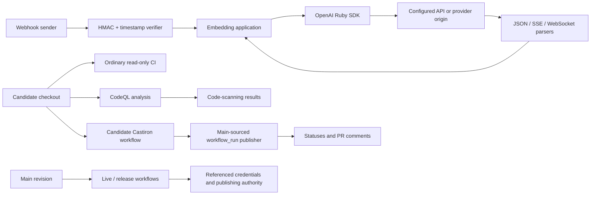

# OpenAI Ruby SDK Security Model

This is the canonical detailed threat model for this repository. `SECURITY.md`
remains the authority for disclosure and reportability; this document is the
authority for architecture, trust boundaries, security invariants, attack
surface, and severity calibration. Codex Security scans must load this file
from the scanned revision instead of relying on a duplicated cloud-configured
model.

## 1. Overview

The OpenAI Ruby gem is a caller-embedded Ruby 3.3+ library, not a hosted
service. It converts caller-supplied configuration, parameters, files, and
credentials into authenticated REST, SSE, and optional Realtime WebSocket
requests, then parses remote responses into typed Ruby values
([README.md](../../README.md#L1-L3),
[README.md](../../README.md#L38-L59)).

| Component | Role | Evidence |
| --- | --- | --- |
| `OpenAI::Client` and generated resources | Public REST entry points, credentials, retries, request options | `lib/openai/client.rb:5-41`, `lib/openai/client.rb:129-170` |
| Base transport, HTTP client, and multipart encoder | URL construction, redirects, retries, default Net::HTTP TLS/pooling, multipart headers/files, serialization, response decoding | `lib/openai/internal/transport/base_client.rb:13-27`, `lib/openai/net_http_client.rb:55-71`, `lib/openai/net_http_client.rb:139-205`, `lib/openai/net_http_client.rb:241-345`, `lib/openai/file_part.rb:33-43`, `lib/openai/file_part.rb:110-119`, `lib/openai/internal/util.rb:533-565`, `lib/openai/http_client.rb:138-237` |
| Streaming and Realtime helpers | Construct authenticated WebSocket handshakes, enforce transport policy, and parse SSE/WebSocket JSON into typed events | `lib/openai/internal/stream.rb:19-60`, `lib/openai/helpers/realtime/client_extension.rb:167-280`, `lib/openai/helpers/realtime/transports/async_websocket.rb:185-308`, `lib/openai/helpers/realtime/connection.rb:47-100` |
| Webhook helper | Verify timestamp and HMAC before parsing webhook events | `lib/openai/resources/webhooks.rb:15-119` |
| Providers and workload identity | Azure, Bedrock, built-in subject-token acquisition, exchange, and X.509 credential paths | `lib/openai/providers/azure.rb:40-58`, `lib/openai/auth/subject_token_providers/gcp_id_token_provider.rb:9-67`, `lib/openai/auth/subject_token_providers/azure_managed_identity_token_provider.rb:9-92`, `lib/openai/auth/subject_token_providers/k8s_service_account_token_provider.rb:9-37`, `lib/openai/auth/workload_identity_auth.rb:280-330` |
| CI and release workflows | Run repository code, upload CodeQL results, publish trusted Castiron results, live checks/examples, and releases | `.github/workflows/ci.yml:18-32`, `.github/workflows/codeql.yml:3-53`, `.github/workflows/castiron-custom-code-comment.yml:4-38`, `.github/workflows/examples-e2e.yml:1-43`, `.github/workflows/create-releases.yml:14-79` |

| Deployment or workflow | Resource or capability | Configuration and precedence | Safe effective value or location | Readers, writers, or recipients | Enforcing control | Evidence or unknowns |
| --- | --- | --- | --- | --- | --- | --- |
| Default SDK | API/admin bearer credential and default Net::HTTP connection | Explicit option, then environment fallback; explicit/data-residency base URL, then `OPENAI_BASE_URL`, then default | Bearer credential to configured origin; default `https://api.openai.com/v1`; pooled connection keyed by origin | Configured API origin | Configured-origin request construction; cross-origin redirects strip credentials and reject bodies; HTTPS downgrade rejected; default Net::HTTP selects TLS from the URL, loads default trust roots, pools by origin, requires configurators to leave new connections unstarted, requires validators to leave previously unstarted connections unstarted, and checks `use_ssl?` against the URL scheme | `lib/openai/client.rb:634-645`, `lib/openai/client.rb:669-693`, `lib/openai/helpers/data_residency.rb:16-33`, `lib/openai/internal/transport/base_client.rb:418-452`, `lib/openai/internal/transport/base_client.rb:153-215`, `lib/openai/net_http_client.rb:55-71`, `lib/openai/net_http_client.rb:139-205`, `lib/openai/net_http_client.rb:241-345` |
| Webhook handler | Webhook secret | Explicit argument, then client option, then `OPENAI_WEBHOOK_SECRET` | In-process HMAC key | Local verifier only | Required headers, freshness window, HMAC, timing-safe comparison before `unwrap` parses JSON | `lib/openai/resources/webhooks.rb:15-119` |
| Workload identity | Built-in GCP/Azure/Kubernetes subject token and exchanged access token | GCP provider uses fixed metadata host/path plus configurable audience/timeout; Azure managed identity uses fixed IMDS endpoint plus configurable resource, identity selectors, API version, and timeout; both metadata fetches inherit Net::HTTP environment-proxy routing; Kubernetes provider uses configured/default token path; exchange uses identity/service-account IDs and default issuer URL | GCP GET to `http://metadata.google.internal/computeMetadata/v1/instance/service-accounts/default/identity`; Azure GET to `http://169.254.169.254/metadata/identity/oauth2/token`; Kubernetes token read from configured/default path; subject token sent to `https://auth.openai.com/oauth/token`; returned token cached in memory | Local GCP/Azure metadata service, caller-owned environment proxy, or token-file path; issuer; configured API origin | Fixed GCP host/path and `Metadata-Flavor` header; fixed Azure IMDS endpoint and `Metadata` header; configured open/read timeouts; Azure JSON parsing and `access_token` extraction; Kubernetes file read/error mapping; token-type mapping, exchange timeout/deadline handling, coordinated refresh; fixed metadata URLs do not bypass caller-owned proxy configuration | `lib/openai/auth/subject_token_providers/gcp_id_token_provider.rb:9-67`, `lib/openai/auth/subject_token_providers/azure_managed_identity_token_provider.rb:9-92`, `lib/openai/auth/subject_token_providers/k8s_service_account_token_provider.rb:9-37`, `lib/openai/auth/workload_identity_auth.rb:13-15`, `lib/openai/auth/workload_identity_auth.rb:280-330` |
| X.509 workload identity | Attested mTLS transport and detached exchanged bearer token | Client uses the identity-configured transport when present, otherwise a caller-supplied attested `http_client` for a detached identity, and selects `X509TokenExchange` before token acquisition | Exchange POST to `https://mtls.auth.openai.com/oauth/token`; API requests use the selected transport's attested global/US/EU mTLS API origin | OpenAI mTLS issuer and matching attested API origin | Exact issuer endpoint and attested API-origin/header checks, TLS peer/hostname verification, proxy policy, no redirects | `lib/openai/client.rb:616-644`, `lib/openai/client.rb:739-756`, `test/openai/auth/x509_client_test.rb:16-34`, `lib/openai/auth/x509_transport.rb:5-10`, `lib/openai/auth/x509_transport.rb:14-26`, `lib/openai/auth/x509_transport.rb:174-237`, `lib/openai/auth/x509_transport.rb:243-315` |
| Azure provider | API key or Entra bearer token | Explicit endpoint/credential, then Azure environment fallback | Credential attached only to normalized Azure origin | Configured Azure endpoint | Origin validation before credential attachment; conflicting auth rejected | `lib/openai/providers/azure.rb:47-58`, `lib/openai/providers/azure.rb:141-147` |
| Bedrock provider | Bearer token or SigV4 authority | Explicit mode, environment, then AWS credential chain | Credential/signature to configured Bedrock origin | Configured Bedrock endpoint | Origin and endpoint/region validation; SigV4 disables redirects | `lib/openai/providers/bedrock.rb:105-168`, `lib/openai/providers/bedrock.rb:398-427` |
| Realtime WebSocket transport | API/workload bearer credential, WebSocket destination, TLS/proxy policy, and trace confidentiality | Client handshake builder applies bearer auth and optional workload-token refresh; caller may select `websocket_base_url` only within provider restrictions | Authenticated `ws://` or `wss://` handshake to configured Realtime origin; proxy credentials stay on CONNECT | Configured Realtime endpoint and optional proxy | Base URL validation, provider/X.509 restrictions, proxy-authorization stripping, WSS peer/hostname verification, trace redaction | `lib/openai/helpers/realtime/client_extension.rb:167-280`, `lib/openai/helpers/realtime/transports/async_websocket.rb:185-224`, `lib/openai/helpers/realtime/transports/async_websocket.rb:294-378` |
| Multipart uploads | Caller file contents, effective filename, content type, and multipart header parameters | Caller supplies `Pathname`, `IO`, or `FilePart`; optional filename/content type | File bytes to configured API origin; effective filename reduced to basename; header parameters escaped | Configured API origin | Media-type validation; `FilePart` basename reduction; encoder basename reduction for raw paths; quote/backslash escaping and CR/LF removal for multipart header parameters | `lib/openai/file_part.rb:33-43`, `lib/openai/file_part.rb:110-119`, `lib/openai/internal/util.rb:533-565` |
| Diagnostic logging | Request/response diagnostics | Explicit log level, then `OPENAI_LOG`; supplied logger or stderr | Sanitized metadata and structural body summaries | Caller logger or stderr | Credential/query redaction; multipart, streaming, binary, and large JSON bodies omitted | `lib/openai/internal/logging.rb:10-26`, `lib/openai/internal/logging.rb:299-343` |
| Dependency acquisition and installation | Gem source, locked revision, transitive gem, native extension, and install/build-script execution | Contributor/CI `Gemfile` selects `syntax_tree-rbs` from GitHub branch `main` and `Gemfile.lock` pins revision `247832988a850b8df050cf207f652872fda49973`; Bedrock CI selects `aws-sdk-core` through `gemfiles/bedrock.gemfile` and its lock; docs lockfiles and gemspec dependencies select other installed code | Locked RubyGems and Git sources plus package metadata from the reviewed revision | CI runners and consumer Bundler/RubyGems installations | Human/source review of dependency and lockfile changes; CI verifies the reviewed checkout but does not make an unreviewed dependency trustworthy | `AGENTS.md:39-42`, `Gemfile:3-15`, `Gemfile.lock:1-20`, `gemfiles/bedrock.gemfile:1-5`, `gemfiles/bedrock.gemfile.lock:1-58`, `.github/workflows/ci-checks.yml:124-144`, `openai.gemspec:18-48`, `docs/Gemfile:1-8`, `docs/Gemfile.lock:1-21` |
| Ordinary PR CI | Candidate checkout execution | Checked-out PR revision runs lint, typecheck, build, and tests | Candidate code executes with repository-code authority | Ephemeral CI runner | `permissions: {}`, `contents: read`, `persist-credentials: false` | `.github/workflows/ci.yml:18-32`, `.github/workflows/ci-checks.yml:100-120` |
| CodeQL PR analysis | Candidate checkout and code-scanning result upload | Pull requests, main pushes, and merge-group checks run action and Ruby analysis | Candidate source produces SARIF under runner temp; `security-events: write` uploads code-scanning results | GitHub code scanning | Top-level `permissions: {}`; job grants only `actions: read`, `contents: read`, and `security-events: write`; pinned checkout/CodeQL actions; `persist-credentials: false`; checked SARIF must exist and contain no findings | `.github/workflows/codeql.yml:3-28`, `.github/workflows/codeql.yml:37-53`, `.github/workflows/codeql.yml:55-96` |
| Trusted Castiron workflow-run publisher | Commit-status and PR-comment writes | Candidate-associated `workflow_run` metadata -> main-sourced reporter recomputes from current Git objects for statuses and successful report comments; fallback failure comments use event/path, current-head, and monotonic-replacement checks | `statuses: write` and `pull-requests: write` only in publisher jobs | GitHub commit statuses and PR comments | Status path: no candidate artifact, run identity validation, exact head/base checks; successful comment path: trusted report artifact; fallback failure-comment path: main-sourced code, event/path filtering, current-head matching, monotonic replacement | `.github/workflows/castiron-custom-code-comment.yml:4-38`, `.github/workflows/castiron-custom-code-comment.yml:40-98`, `.github/workflows/castiron-custom-code-comment.yml:116-171`, `.github/workflows/castiron-custom-code-comment.yml:174-237` |
| Live/release workflows | API keys, X.509 material, GitHub App private key, generated GitHub App token, RubyGems OIDC | Main-only conditions plus named environments; release job passes `OPENAI_SDKS_APP_PRIVATE_KEY` to pinned token action, then passes generated token to Release Please | Referenced long-lived private key as action input; generated short-lived release token; publishing OIDC | Main revision, token action, OpenAI API, GitHub, RubyGems | Repository/ref conditions, separate named environments, least privilege, pinned actions, generated token handoff, OIDC only for publishing | `.github/workflows/live-smoke.yml:17-92`, `.github/workflows/create-releases.yml:17-79` |
| Examples E2E workflow | Live-example API credential and uploaded reports | Manual dispatch; main/repository condition; named `ci` environment; `OPENAI_API_KEY` secret reference | Credential only in the live-example step; allowlisted `report.json` and `summary.md` under runner temp | OpenAI API and GitHub artifact readers | `permissions: {}`, `contents: read`, checkout without persisted credentials, main/repository condition, allowlisted reports, 14-day retention, focused confidentiality/isolation tests | `.github/workflows/examples-e2e.yml:1-43`, `test/scripts/examples_e2e_test.rb:202-234`, `test/scripts/examples_e2e_test.rb:306-327` |

## 2. Threat Model, Trust Boundaries, and Assumptions

Protected assets include caller API/admin/provider credentials, workload subject
tokens and exchanged access tokens, webhook secrets, X.509 private-key
material, uploaded file contents, request destinations and headers, parsed
response integrity, diagnostic confidentiality, GitHub App private-key
material, and release/publishing integrity.

Important boundaries:

- Caller-controlled parameters, headers, files, base URLs, callbacks, loggers,
  and custom transports cross into SDK request construction. These remain
  caller authority inside the embedding process; the SDK is not a sandbox
  (`lib/openai/http_client.rb:138-142`,
  `lib/openai/internal/transport/base_client.rb:293-339`).
- Configured origin to redirect destination is a network boundary. Credential
  headers must not reach a different origin, request bodies must not cross
  origins, and HTTPS must not downgrade to HTTP
  (`lib/openai/internal/transport/base_client.rb:153-215`).
- The default Net::HTTP implementation is the ordinary REST TLS and connection-
  reuse boundary. It derives TLS from the requested scheme, installs default
  trust roots, keys pools by origin, requires configurators to leave new
  connections unstarted, requires validators to leave previously unstarted
  connections unstarted, and checks `use_ssl?` against the URL scheme each time
  (`lib/openai/net_http_client.rb:55-71`,
  `lib/openai/net_http_client.rb:139-205`,
  `lib/openai/net_http_client.rb:241-345`).
- API, SSE, and WebSocket bytes cross parser/type-conversion boundaries. They
  are parsed as data, not evaluated as code
  (`lib/openai/internal/stream.rb:21-60`,
  `lib/openai/helpers/realtime/connection.rb:61-84`).
- Raw webhook payloads and headers cross an authenticity boundary. `unwrap`
  verifies freshness and HMAC before parsing or coercion
  (`lib/openai/resources/webhooks.rb:15-23`,
  `lib/openai/resources/webhooks.rb:75-119`).
- Built-in subject-token sources, the generic token issuer, and Azure/Bedrock
  endpoints are credential-brokering boundaries. GCP acquisition uses the fixed
  plaintext metadata host/path and metadata header with configurable audience
  and timeout; Azure managed-identity acquisition uses the fixed plaintext IMDS
  endpoint and metadata header with configurable resource, identity selectors,
  API version, and timeout, then parses the returned JSON token. Both metadata
  fetches inherit Net::HTTP environment-proxy routing, so a caller-owned proxy
  can mediate the plaintext request/response and fixed URLs alone do not prove
  direct source binding. Kubernetes acquisition reads its configured/default
  token path and maps file failures. Credentials must remain bound to their
  intended source, proxy, issuer, and destination
  (`lib/openai/auth/subject_token_providers/gcp_id_token_provider.rb:9-67`,
  `lib/openai/auth/subject_token_providers/azure_managed_identity_token_provider.rb:9-92`,
  `lib/openai/auth/subject_token_providers/k8s_service_account_token_provider.rb:9-37`,
  `lib/openai/auth/workload_identity_auth.rb:280-330`,
  `lib/openai/providers/azure.rb:141-147`,
  `lib/openai/providers/bedrock.rb:398-427`).
- X.509 workload identity is a separate credential boundary: the exchange uses
  the fixed mTLS issuer while API requests use the selected transport's attested
  matching mTLS origin. The certificate identity and exchanged bearer token
  remain detached; controls enforce the exact issuer endpoint and approved API
  origin/header/TLS/proxy/no-redirect policy
  (`lib/openai/client.rb:616-644`,
  `lib/openai/client.rb:739-756`,
  `test/openai/auth/x509_client_test.rb:16-34`,
  `lib/openai/auth/x509_transport.rb:5-10`,
  `lib/openai/auth/x509_transport.rb:174-315`).
- Authenticated Realtime handshakes are a transport boundary distinct from
  event parsing. Bearer credentials, caller-selected WebSocket destinations,
  TLS, proxy credentials, and traces must remain bound to their intended
  origin and diagnostic audience
  (`lib/openai/helpers/realtime/client_extension.rb:167-280`,
  `lib/openai/helpers/realtime/transports/async_websocket.rb:185-224`,
  `lib/openai/helpers/realtime/transports/async_websocket.rb:294-378`).
- Multipart upload serialization is a file-path and header-integrity boundary.
  `FilePart` validates media types and reduces explicit or inferred filenames to
  basenames; the encoder again basenames raw paths and escapes quote, backslash,
  CR, and LF header-parameter characters before bytes reach the API origin
  (`lib/openai/file_part.rb:33-43`,
  `lib/openai/file_part.rb:110-119`,
  `lib/openai/internal/util.rb:533-565`).
- Runtime/API data crossing into logs, exceptions, retained metadata objects, or
  CI artifacts is a sensitive sink boundary. Logging redacts or omits sensitive
  bodies; derived HTTP status messages are bounded and sanitized when no
  top-level scalar or explicit message is supplied; top-level scalar and
  explicit SSE error messages remain remote data; Realtime connection errors
  redact call IDs from URLs; response metadata omits retained bodies from
  inspection and serialization
  (`lib/openai/internal/logging.rb:299-343`,
  `lib/openai/errors.rb:259-409`,
  `lib/openai/internal/stream.rb:35-40`,
  `lib/openai/helpers/realtime/errors.rb:26-70`,
  `lib/openai/http_client.rb:46-79`,
  `CONTRIBUTING.md:42-50`).
- Candidate PR code reaching sensitive live/release credentials or repository
  write/publishing authority is a genuine boundary
  (`.github/workflows/live-smoke.yml:17-92`,
  `.github/workflows/examples-e2e.yml:1-43`,
  `.github/workflows/create-releases.yml:17-79`).
- The release GitHub App private key is distinct from the generated app token.
  The main/repository-gated release job passes the referenced private key only
  to a pinned token action, which mints the narrower token passed to Release
  Please; disclosure of the private key can outlive one generated token
  (`.github/workflows/create-releases.yml:17-46`).
- Candidate source and generated SARIF crossing into CodeQL result upload are a
  separate PR-adjacent write boundary. The workflow scopes the token to
  `security-events: write` plus read-only metadata/content, uses pinned actions
  without persisted checkout credentials, and validates that SARIF exists and
  has no findings before the job succeeds
  (`.github/workflows/codeql.yml:3-28`,
  `.github/workflows/codeql.yml:37-53`,
  `.github/workflows/codeql.yml:55-96`).
- The manually dispatched Examples E2E job is a separate live-data boundary:
  its main/repository-gated job references `OPENAI_API_KEY`, runs examples, and
  always uploads only two allowlisted reports. Tests enforce report
  confidentiality and workflow isolation
  (`.github/workflows/examples-e2e.yml:1-43`,
  `test/scripts/examples_e2e_test.rb:202-234`,
  `test/scripts/examples_e2e_test.rb:306-327`).
- Candidate-associated `workflow_run` metadata and Git objects crossing into
  the trusted Castiron publisher are a genuine write-capable boundary. The
  status path must preserve run-identity and exact-head/base checks; successful
  report comments must remain bound to the trusted report artifact. The
  fallback failure-comment path has narrower main-sourced event/path,
  current-head, and monotonic-replacement checks that scans must assess
  independently
  (`.github/workflows/castiron-custom-code-comment.yml:34-98`,
  `.github/workflows/castiron-custom-code-comment.yml:116-171`,
  `.github/workflows/castiron-custom-code-comment.yml:174-237`).
- Dependency declarations and locks cross a supply-chain boundary when Bundler
  or RubyGems fetches and executes selected package code in CI or consumer
  applications. A changed source, Git revision, transitive gem, native
  extension, or install/build script needs explicit dependency review. The root
  contributor/CI bundle currently selects `syntax_tree-rbs` from GitHub branch
  `main` and locks revision `247832988a850b8df050cf207f652872fda49973`; the
  Bedrock CI job separately selects `aws-sdk-core` through
  `gemfiles/bedrock.gemfile` and its lock
  (`AGENTS.md:39-42`, `Gemfile:3-15`, `Gemfile.lock:1-20`,
  `gemfiles/bedrock.gemfile:1-5`, `gemfiles/bedrock.gemfile.lock:1-58`,
  `.github/workflows/ci-checks.yml:124-144`,
  `openai.gemspec:18-48`,
  `docs/Gemfile:1-8`, `docs/Gemfile.lock:1-21`).

Checked-in executable source has repository-code authority. Reviewed tracked
examples, tests, fixtures, Rake tasks, build scripts, generators, and other
checkout files are intentionally executable by local development and ordinary
PR CI. A contributor who can modify those tracked files does not gain a new
privilege merely because CI executes them. Do not report that execution alone
as a security finding.

That rule does not suppress a real finding when independently mutable
lower-trust input crosses a parser/evaluator boundary, untrusted runtime/API/
network data reaches a sensitive sink, candidate code can reach sensitive
secrets or write/publishing authority, or shipped production code violates a
security invariant.

Assumptions:

- The embedding application owns its local filesystem, network, process,
  callback, proxy, and credential authority.
- Custom transports, token providers, and loggers are caller-owned extension
  points, not less-trusted sandboxed plugins.
- Azure and Bedrock custom HTTP endpoints are caller-selected; HTTPS outside
  local/private testing is a caller obligation where the provider permits HTTP.
- External branch protection, environment approval rules, secret configuration,
  and RubyGems trusted-publisher bindings are not proven by repository files.
- Large JSON bodies and SSE events are supported API contracts; arbitrary fixed
  rejection limits are not an acceptable security fix.

## 3. Attack Surface, Mitigations, and Attacker Stories

The following are hypotheses and review guidance, not confirmed findings.

| Priority | Scenario and capability gain | Prerequisites | Impact | Existing controls | Mitigation | Evidence |
| --- | --- | --- | --- | --- | --- | --- |
| High | Redirect, TLS, or pooled-connection confusion sends credentials or a body to an unintended origin | Remote endpoint controls redirect or caller/provider origin handling is bypassed, or default connection validation/pooling regresses | Credential or payload disclosure | Cross-origin credential stripping, body rejection, HTTPS downgrade rejection, provider origin validation, default trust roots, origin-keyed pools, return-time unstarted postconditions for new connections, scheme-matched `use_ssl?` checks | Preserve origin, redirect, TLS, and pool controls | `lib/openai/internal/transport/base_client.rb:153-215`, `lib/openai/providers/azure.rb:141-147`, `lib/openai/net_http_client.rb:55-71`, `lib/openai/net_http_client.rb:139-205`, `lib/openai/net_http_client.rb:241-345` |
| High | Candidate PR code reaches live/release credentials or publishing authority | Privileged workflow executes candidate code or exposes secrets/write tokens | Credential theft or release compromise | Main-only conditions, named environments, least-privilege permissions, trusted publisher separation | Keep candidate and live/release workflows isolated | `.github/workflows/live-smoke.yml:17-92`, `.github/workflows/create-releases.yml:17-79` |
| High | Release GitHub App private key reaches an unintended action, log, or artifact | Main/repository release gate or pinned token-action input boundary regresses | Attacker can mint GitHub App tokens beyond one workflow token lifetime | Main/repository condition, named release environment, empty job permissions, pinned token action, generated token passed separately to Release Please | Keep the private key confined to token minting and preserve generated-token handoff | `.github/workflows/create-releases.yml:17-46` |
| Medium | Candidate source or generated SARIF influences the write-capable CodeQL upload outside its intended code-scanning result path | PR-adjacent CodeQL action or token scoping regresses | Forged or unintended code-scanning results | Top-level empty permissions; scoped `security-events: write`; read-only content/metadata; pinned actions; no persisted checkout credentials; SARIF existence/shape/finding checks | Preserve least privilege and keep upload input limited to CodeQL output | `.github/workflows/codeql.yml:3-28`, `.github/workflows/codeql.yml:37-53`, `.github/workflows/codeql.yml:55-96` |
| High | Candidate-associated workflow metadata or Git objects influence the write-capable Castiron publisher without the path-specific trusted validation | Attacker controls a PR head or associated workflow metadata and a status, successful-comment, or fallback-comment check regresses | Forged or stale commit statuses and PR comments | Statuses use main-sourced recomputation plus run/head/base checks; successful comments use a trusted report artifact; fallback comments rely on main-sourced event/path, current-head, and monotonic-replacement checks | Preserve each path's distinct recomputation, freshness, artifact-binding, or fallback-isolation checks before its write | `.github/workflows/castiron-custom-code-comment.yml:34-98`, `.github/workflows/castiron-custom-code-comment.yml:116-171`, `.github/workflows/castiron-custom-code-comment.yml:174-237` |
| High | A dependency declaration or lockfile selects malicious package code, native extension, or install/build script | Lower-trust change alters a source, Git revision, transitive dependency, or executable package hook that CI or a consumer installs; the contributor/CI bundle currently includes Git-sourced `syntax_tree-rbs` locked at `247832988a850b8df050cf207f652872fda49973`; Bedrock CI separately installs its `aws-sdk-core` bundle | Code execution in CI or consumer applications | Reviewed lockfiles and dependency policy; ordinary and Bedrock CI execute selected dependencies with runner authority | Review direct/transitive dependencies, sources, locked revisions, native extensions, and scripts before acceptance | `AGENTS.md:39-42`, `Gemfile:3-15`, `Gemfile.lock:1-20`, `gemfiles/bedrock.gemfile:1-5`, `gemfiles/bedrock.gemfile.lock:1-58`, `.github/workflows/ci-checks.yml:124-144`, `openai.gemspec:18-48`, `docs/Gemfile:1-8`, `docs/Gemfile.lock:1-21` |
| High | Built-in subject-token acquisition or exchange sends a token to an unintended source, proxy, issuer, or origin | Lower-trust configuration, caller-owned environment proxy, local token path, metadata response, or endpoint handling is bypassed | Credential disclosure or forged authentication | Fixed GCP metadata host/path/header with configurable audience/timeout; fixed Azure IMDS endpoint/header with configurable resource/selectors/API version/timeout and JSON token extraction; inherited Net::HTTP environment-proxy routing remains caller-owned; configured/default Kubernetes path with mapped failures; fixed/default issuer paths, origin checks, X.509 destination restrictions | Preserve strict source, proxy, destination, timeout, redirect, and response-parsing handling | `lib/openai/auth/subject_token_providers/gcp_id_token_provider.rb:9-67`, `lib/openai/auth/subject_token_providers/azure_managed_identity_token_provider.rb:9-92`, `lib/openai/auth/subject_token_providers/k8s_service_account_token_provider.rb:9-37`, `lib/openai/auth/workload_identity_auth.rb:303-330`, `lib/openai/providers/bedrock.rb:398-427` |
| High | Realtime bearer credentials, proxy credentials, or trace data reach an unintended destination or audience | Lower-trust destination, proxy, TLS, or tracing behavior bypasses handshake controls | Credential disclosure or authenticated connection to the wrong peer | Base-URL/provider restrictions, proxy-header stripping, WSS verification, proxy handling, trace redaction | Preserve destination/TLS/proxy/redaction controls independently from event parsing | `lib/openai/helpers/realtime/client_extension.rb:167-280`, `lib/openai/helpers/realtime/transports/async_websocket.rb:185-224`, `lib/openai/helpers/realtime/transports/async_websocket.rb:294-378` |
| Medium | Malformed or adversarial API/SSE/WebSocket data causes sensitive leakage, type confusion, or availability failure | Victim consumes untrusted remote data | Data exposure, incorrect application behavior, or DoS | JSON parsing, typed coercion, protocol errors, safe unknown events | Keep parsers data-only, incremental where applicable, and redact errors/logs | `lib/openai/internal/stream.rb:21-60`, `lib/openai/helpers/realtime/connection.rb:61-84` |
| Medium | Multipart filename, content type, or field name reaches headers without normalization | Caller-supplied path or header parameter crosses multipart serialization | Absolute local path disclosure or multipart header injection | Media-type validation, basename reduction for `FilePart` and raw path/IO values, quote/backslash escaping, CR/LF removal | Preserve basename and header-parameter controls before upload | `lib/openai/file_part.rb:33-43`, `lib/openai/file_part.rb:110-119`, `lib/openai/internal/util.rb:533-565` |
| Medium | Forged webhook, or replay of a captured valid webhook, becomes an accepted typed event | For forgery, attacker lacks the webhook secret; for replay, attacker can resend a valid signed payload within the tolerance window | Application accepts an unauthentic or repeated event | Required headers, HMAC, and timing-safe comparison reject forgery; timestamp validation bounds replay age but does not deduplicate `webhook-id` | Verify before parsing; callers that need replay prevention must deduplicate `webhook-id` | `lib/openai/resources/webhooks.rb:15-119` |
| Medium | Sensitive runtime or live-example data leaks through diagnostics, exceptions, retained metadata, or artifacts | Untrusted data reaches logger/error/object serialization or a live-example report | Credential, prompt, response, file, header, or call-identifier disclosure | Redacted headers/queries; unsafe body categories omitted; derived HTTP errors are bounded/sanitized when no top-level scalar or explicit message is supplied; top-level scalar and explicit SSE messages remain remote data; Realtime URL call-ID redaction; retained bodies omitted from inspect/YAML/Marshal; Examples E2E reports are allowlisted and tested for sensitive output | Preserve redaction, bounded derived errors, metadata serialization controls, and allowlisted artifacts; treat preserved remote messages as remote data | `lib/openai/internal/logging.rb:299-343`, `lib/openai/errors.rb:259-409`, `lib/openai/internal/stream.rb:35-40`, `lib/openai/helpers/realtime/errors.rb:26-70`, `lib/openai/http_client.rb:46-79`, `.github/workflows/examples-e2e.yml:29-43`, `test/scripts/examples_e2e_test.rb:202-234`, `test/scripts/examples_e2e_test.rb:306-327`, `CONTRIBUTING.md:42-50` |
| Not a finding by itself | Contributor changes a tracked test/example/fixture/build script and ordinary CI runs it | Contributor already controls candidate checkout code | No new authority | Read-only ordinary CI without referenced secrets or write authority | Require a separate privilege or boundary violation before reporting | `.github/workflows/ci.yml:18-32`, `.github/workflows/ci-checks.yml:100-120` |

## 4. Severity Calibration

- Critical: unauthorized release/publishing compromise, protected credential
  theft with broad impact, or a cross-account/tenant boundary failure.
- High: realistic credential disclosure, authenticated request redirection,
  protected CI/release boundary bypass, or forged authentication with meaningful
  account impact.
- Medium: production-reachable parser, webhook, retry, logging, or availability
  failures with bounded impact or meaningful prerequisites.
- Low: narrowly reachable confidentiality/integrity defects with limited impact
  and strong mitigating prerequisites.
- Out of scope without additional authority: ordinary execution of
  contributor-controlled tracked checkout code, caller-chosen dangerous
  configuration, caller-owned callbacks/custom transports, purely local
  self-effects, and hypothetical stories without a realistic lower-trust route
  to a sensitive operation.

Severity depends on the attacker's initial authority, the new capability gained,
reachability, deployment prerequisites, and effective controls. Missing evidence
is an explicit uncertainty, not proof that a control succeeds or fails.
